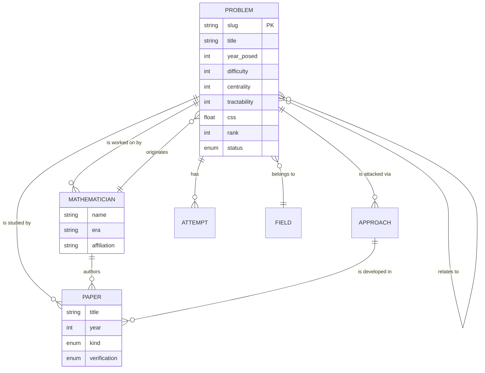

# 🏗️ Architecture

> How the Unsolved Mathematics Atlas is engineered as a reproducible, machine-
> readable knowledge system rather than a static document.

## 1. Design goals

| Goal | Mechanism |
|------|-----------|
| **Single source of truth** | All problem metadata lives in `data/problems.yaml`. Nothing authoritative is duplicated by hand. |
| **Reproducible ranking** | `scripts/generate.py` computes the Composite Severity Score; ordering is a pure function of the registry. |
| **Idempotent scaffolding** | Re-running the generator never clobbers human-written prose — it only fills gaps and refreshes generated artifacts. |
| **Machine-ingestible** | Every dossier is chunked into `rag/corpus.jsonl`; retrieval works out of the box. |
| **Provenance everywhere** | Papers/people carry verification flags; chunks link back to source files. |
| **CI-enforced integrity** | Schema validation, ranking freshness, and corpus build run on every push. |

## 2. Data-flow

```
            ┌────────────────────────┐
            │   data/problems.yaml   │   (human-edited source of truth)
            └───────────┬────────────┘
                        │  scripts/generate.py
        ┌───────────────┼─────────────────────────────┐
        ▼               ▼                               ▼
 data/problems.json   RANKING.md / README table   problems/<slug>/*.md
 (computed registry)  (generated views)           (scaffolded dossiers)
        │                                               │
        │                                  rag/build_corpus.py
        │                                               ▼
        │                                       rag/corpus.jsonl
        │                                               │
        │                                   rag/embed_index.py (optional)
        │                                               ▼
        └───────────────────────────────────────▶ rag/index.npz
                                                        │
                                                rag/retriever.py
                                                  (BM25 / dense)
```

## 3. Components

### 3.1 Registry (`data/problems.yaml`)
The canonical list. Each entry is validated against
[`schema/problem.schema.json`](schema/problem.schema.json). Scores are 0–100
editorial estimates; `year_posed` may be negative (BCE).

### 3.2 Build engine (`scripts/generate.py`)
- validates the registry,
- computes CSS and the canonical rank,
- writes `data/problems.json`, `RANKING.md`, and patches the README ranking block,
- scaffolds each `problems/<slug>/` folder with eight dossier files + `metadata.json` + `rag/`.

Idempotency rule: prose files are written **only if absent**; `metadata.json` is
always regenerated (it is fully derived).

### 3.3 Dossier (`problems/<slug>/`)
The unit of knowledge. Eight markdown files (see README) plus a machine record.
Folders are keyed by the **stable slug**, never by rank — ranks shift as scores
are refined, so the rank lives in `metadata.json` and `RANKING.md` instead. The
generator reconciles the tree on every run: orphaned, unauthored folders (whose
slug left the registry) are removed; authored orphans are flagged, never deleted.

### 3.4 RAG layer (`rag/`)
Heading-aware, token-aware chunker → JSONL corpus → BM25 (zero-dep) or dense
(sentence-transformers) retrieval. See [rag/README.md](rag/README.md).

### 3.5 Documentation (`docs/`)
- `architecture/` — the ER model and data model (below).
- `methodology/` — ranking formula and sourcing standards.
- `kanban/` — the live research board.

## 4. Entity model (summary)

The atlas is, conceptually, a small graph database flattened into files. The
core entities and relationships:



The full ER specification, including cardinalities and the "ERP" (Entity-
Relationship-Process) operational layer, is in
[docs/architecture/ERD.md](docs/architecture/ERD.md).

## 5. Build & CI

| Workflow | Trigger | Does |
|----------|---------|------|
| `ci.yml` | push / PR | install deps, `generate.py --check`, build corpus, run tests |
| `validate-registry.yml` | push to `data/**` | schema-validate the registry, fail on drift |
| `pages.yml` *(optional)* | push to `main` | publish the atlas as a static site |

CI fails if the committed `RANKING.md` / README table is stale relative to the
registry — the generated views must always match their source.

## 6. Extending

Adding a problem is a one-file change plus one command:

```bash
# 1. append an entry to data/problems.yaml (must satisfy the schema)
# 2. rebuild
python scripts/generate.py
python rag/build_corpus.py
# 3. flesh out the new problems/<slug>/*.md dossier
```

See [CONTRIBUTING.md](CONTRIBUTING.md) for the authoring and sourcing standards.
