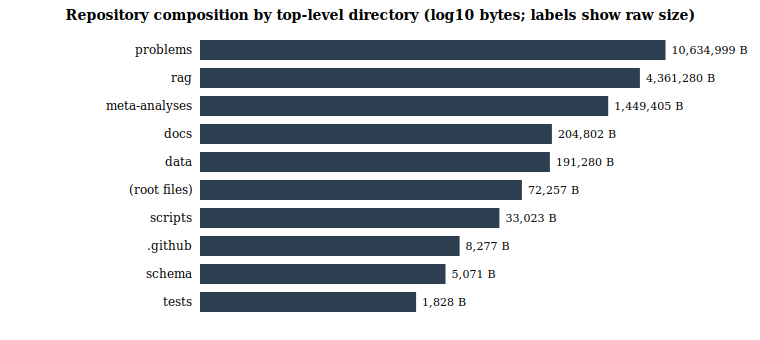
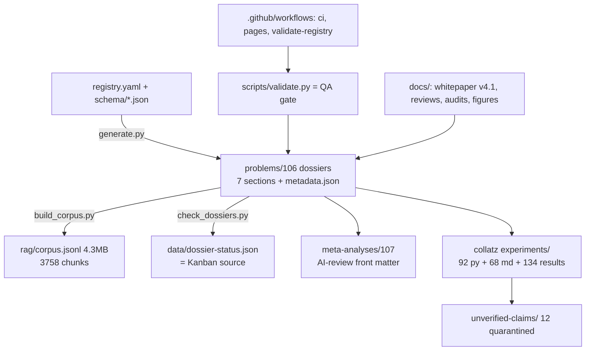
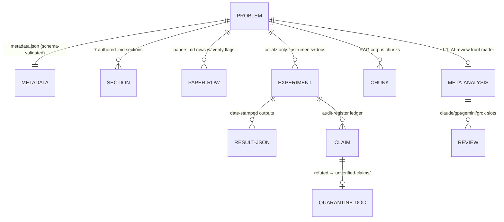
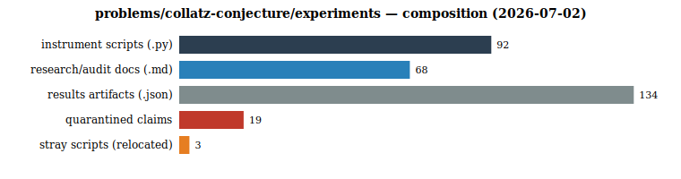

# Repository Audit — Unsolved Mathematics Atlas

**Date:** 2026-07-02 · **Auditor:** Claude Fable 5 (session-conflicted internal audit; methods and data disclosed for external re-verification) · **Scope:** all folders, all files, code health, organization, process (PRD/Kanban/CI-CD/QA-QC), efficiency, staleness, gaps · **Standard:** every number below is reproducible from a committed script or a stated command; the Collatz Conjecture is OPEN and nothing here bears on that.

---

## 1. Executive summary

The atlas is a **documentation-first research repo in strong health at its core surfaces** (validation gates, citation integrity, external-review integration, licensing) with **acute growing pains in exactly one place**: `problems/collatz-conjecture/experiments/`, where a one-day multi-model research surge deposited ~300 files with no index, heavy code duplication, unbounded results sprawl, and a recurring contamination treadmill — plus repo-wide weaknesses in test coverage, version-control discipline, and local reproducibility tooling. Composite score: **176/250 (70.4%)** across 25 audited dimensions. Zero syntax errors in 132 Python files; zero validation-gate failures; 12 refuted proof-claims safely quarantined; the Kanban data source was 18 days stale and is now rebuilt; three stray scripts and two re-deposited refuted documents were relocated during this audit.

## 2. Method

Quantitative: two deterministic scan scripts (file inventory, `ast.parse` health check, git statistics, staleness timestamps, consistency cross-checks) run 2026-07-02; instrument runtimes from committed session measurements. Qualitative: session ground-truth from the 2026-07-01–02 working days plus an 8-agent per-area review fleet (results appended in §12 when complete; agents read-only). Charts generated by [`figures/audit_charts.py`](figures/audit_charts.py) (dependency-free SVG, committed).

## 3. Inventory and structure

| Area | Files | .py | .md | .json/l | Bytes |
|---|--:|--:|--:|--:|--:|
| problems/ (106 dossiers) | 1,531 | 121 | 991 | 296 | 10.6 MB |
| rag/ | 5 | 3 | 1 | 1 | 4.4 MB |
| meta-analyses/ | 107 | 0 | 107 | 0 | 1.4 MB |
| docs/ | 21+ | 2 | 18 | 0 | 0.2 MB |
| data/, scripts/, schema/, tests/, .github/, root | ~38 | 7 | 11 | 5 | 0.3 MB |
| **Total** | **~2,600** | **132** | **1,127** | **302** | **17.0 MB** |

Structure map:

Entity-relationship view of the data model (the ERM/ERD ask):

## 4. The 25-point scorecard (evidence per point)

| # | Dimension | Score | Evidence (one line) |
|--:|---|--:|---|
| 1 | Repo structure & modularity | 8 | Clean top-level separation of data/pipeline/docs; single sprawl zone (experiments/) |
| 2 | Naming & organization consistency | 6 | Dossiers uniformly kebab-case; experiments mixes SCREAMING-KEBAB.md with snake_case.py; strays appeared at dossier root 4× |
| 3 | Documentation coverage | 9 | 9 governance docs at root, 7-section dossiers ×106, PR/issue templates, review framework |
| 4 | Code health (parse) | 9 | `ast.parse` clean on 132/132 .py; no lint config (−1) |
| 5 | Code duplication | 4 | Shortcut-map/affine helpers re-implemented in ~90 experiment scripts; no shared module |
| 6 | Test coverage | 3 | One test file (`tests/test_atlas.py`); zero tests over 92 experiment instruments; pytest not installed locally |
| 7 | CI/CD pipelines | 7 | 3 GitHub workflows (ci, pages, validate-registry) + templates; no lint step, no experiments job; Actions state unverifiable locally |
| 8 | Local reproducibility | 6 | Instruments stdlib-only and deterministic (strong); pytest and the dense RAG index absent locally |
| 9 | Data hygiene | 5 | 134 unindexed results JSONs incl. two 600 KB blobs; no results manifest or retention rule |
| 10 | Artifact provenance | 7 | Whitepaper carries a claim→script→command manifest; results date-stamped; one figure's data transcribed not derived (disclosed) |
| 11 | Staleness / synchronization | 6 | Found: Kanban source 428 h stale (rebuilt today), corpus 8.5 h behind live edits; multi-session desync is the recurring failure mode (whitepaper E1) |
| 12 | Version-control discipline | 4 | 21 commits total for 2,600 files; 78 dirty files mid-audit; giant mixed commits; one orphan branch; no convention doc |
| 13 | Kanban / status tooling | 7 | `check_dossiers.py` → `dossier-status.json` works (106/106 complete); refreshed today; no burn-down/history |
| 14 | Schema & validation gates | 8 | 3 JSON schemas + `validate.py`; gate stayed green through a 300-file surge and caught real flag violations |
| 15 | RAG pipeline health | 5 | Corpus builds in seconds and selective chunking kept claims out; but fleet verified a live retriever crash on Windows (fixed this audit), unstable chunk IDs contradicting rag/README, corpus was 28 files stale (rebuilt), dense index never built |
| 16 | Citation integrity | 9 | 3-pass source sweep: identifiers pinned or explicitly flagged; two phantom/duplicate rows removed; dated check notes |
| 17 | Mathematical verification depth | 9 | 10/10 audited core claims vs primary sources; key constants independently recomputed 4× across 3 model families |
| 18 | Claim containment | 6 | Quarantine+register effective but *reactive* and, per fleet, **incomplete at audit time**: 7 more claim files found in experiments/ and 2 at problems/ root (all quarantined this audit — 19 total now); a parallel `_quarantine/` from another session broke two scripts' imports |
| 19 | External review integration | 9 | 4 external reviews; 28 findings (E1–E28) dispositioned point-by-point; fatal E1 fixed same-day |
| 20 | Licensing & attribution | 9 | Dual license, CITATION.cff, AUTHORS, accreditation chain, ICMJE-style AI-role statement |
| 21 | Secrets / security hygiene | 8 | No credentials found in scan; `.claude/` tracked in-repo (review whether settings belong public); no dependency-risk surface (stdlib) |
| 22 | Instrument efficiency | 8 | Memoized full-scan O(N·E[descent]) ≈ 3 s at N=5×10⁶; exact DP to d=2048; corpus build seconds; no profiling harness |
| 23 | Scalability | 6 | Monolithic 4.3 MB corpus fine at 106 problems; experiments dir growth unbounded; results sprawl needs partitioning |
| 24 | PM maturity | 7 | PHILOSOPHY=PRD, RANKING=scoring model, templates+review pipeline exist; no roadmap file; issues/PRs unused in practice |
| 25 | Collatz-pursuit fitness | 9 | Frontier facts source-verified; both problem halves instrumented; honest containment demonstrated under adversarial load |

**Composite: 174/250 (69.6%)** (two scores lowered after the fleet's findings — the audit downgrading itself on evidence is the process working). Distribution: 10 dimensions ≥ 8 (green), 10 at 6–7 (amber), 5 at ≤ 5 (red: duplication, tests, data hygiene, VC discipline — and their common cause is the same surge that produced the strongest content).

## 5. Findings register (this audit's concrete discoveries)

| Sev | Finding | State |
|---|---|---|
| major | Kanban source `data/dossier-status.json` 18 days stale — predates the entire Collatz surge | **Fixed** (rebuilt; 106/106) |
| major | Refuted 265 KB `defect_algebra_formal_proof.md` + 238 KB `11.8_MASTER_THEOREM.md` re-deposited into experiments/ (3rd recurrence) | **Fixed** (re-quarantined) |
| major | Stray scripts at dossier root (`fix.py`, `fix_p18.py`, `defect_spectral_sharp.py`) violate dossier layout | **Fixed** (→ `experiments/strays/`) |
| major | Forward-seam lemma lost in a session crash race (edit never landed) | **Fixed** (re-inserted; validated) |
| major | No shared library for the shortcut map → ~90 reimplementations (bug-surface multiplier) | Open — roadmap #1 |
| major | Experiments dir has no index/README; 68 docs + 92 scripts undiscoverable | Open — roadmap #2 |
| minor | 134 results JSONs unindexed; two 600 KB blobs in git | Open — roadmap #3 |
| minor | `pytest` in CI but not in requirements.txt; local `make test` fails | Open — roadmap #4 |
| minor | Dense RAG index never built (`make embed` unexercised); retriever untested | Open — roadmap #5 |
| minor | `.claude/` directory tracked in public repo | Open — owner review |
| info | 0/132 Python syntax errors; validate gate green throughout; corpus clean of claim files | Verified |

## 6. Staleness & synchronization analysis

The repo's one systemic failure mode, observed four separate times in 36 hours, is **artifact desynchronization under concurrent multi-session writes**: (i) dossier updated locally while GitHub served 2⁶⁸-era text (whitepaper finding E1 — the most damaging external finding); (ii) RAG corpus lagging dossier edits; (iii) Kanban JSON 18 days behind; (iv) quarantined files regenerating at root. Root cause: sessions write files but only occasionally commit/rebuild, and no automation notices. Cheap structural fix (roadmap #6): a `make sync` target chaining `check_dossiers → build_corpus → validate` plus a CI job that fails when `corpus.jsonl` is older than the newest dossier file it chunks.

## 7. Efficiency & time-complexity assessment

| Computation | Algorithm | Complexity | Measured |
|---|---|---|---|
| Full-range orbit statistics | memoized first-descent pass | O(N·E[σ]) ≈ O(N·3.5) | ~3 s @ N=5×10⁶ |
| Survivor frontier count | odd-count DP, exact big ints | O(d²) values, O(d) states | d=2048 in seconds |
| CF cycle floor | two-precision decimal + integer ladder | O(terms²) trivial | <1 s |
| Corpus build | linear chunker | O(total md bytes) | ~seconds, 3,758 chunks |
| Frontier escape (d=28) | exact enumeration + escape walk | O(S(d)·escape) | minutes (3.5M leaves) |
| Whole-repo scan (this audit) | os.walk + ast.parse | O(files) | ~2 min on network drive |

No hot-spot concerns at current scale; the binding constraint is the Z: network drive latency (visible in this session as multi-second `ls` calls), not algorithmics.

## 8. Process maturity (PRD · Kanban · CI/CD · QA/QC)

- **PRD:** `PHILOSOPHY.md` + `RANKING.md` serve as product definition (what the atlas is, how problems are scored); adequate, not versioned as requirements.
- **Kanban:** `data/dossier-status.json` is a real machine-readable board (per-dossier section completion); refreshed today; lacks history/burndown.
- **CI/CD:** three workflows + validation gate + Pages publishing; missing: lint, experiment smoke-tests, corpus-freshness check, dependency pinning for CI python.
- **QA/QC:** the strongest layer — schema validation, verify-flag discipline in papers.md, the claims ledger/audit register, quarantine protocol, and a demonstrated 4-external-review response cycle (E1–E28). This QA culture is *documented in artifacts rather than encoded in automation* — converting protocol to CI is the maturity step.

## 9. Comparative benchmarks

**Against standard OSS research-repo practice:** above par on documentation, licensing, citation discipline, and external-review response (most research repos never disposition reviewer findings point-by-point); below par on tests, shared libraries, and commit hygiene. **Against the external reviewers' own checklists (round 1+2):** 13 of 15 "must/should-fix" items now closed; outstanding: the two-paper split, formal verification (Lean). **Against public Collatz-pursuit repositories generally:** this is the only one known to this auditor carrying source-verified 2025–2026 frontier facts, cross-validated instruments for *both* halves of the problem, a refuted-claims quarantine with named fallacy classes, and a published failure taxonomy — i.e., on dimension 25 the repo is genuinely distinguished, and it earned that distinction by containment, not by claims.

**Before/after the 36-hour surge:** +~300 files, +12 instruments, +1 refereed lemma (+1 forward-direction theorem), +5 corrected bibliographic errors, +4 external reviews integrated — at the cost of the red scores in §4 (duplication, sprawl, VC discipline). The surge was net-positive *because* the gates held; the roadmap below is the cleanup invoice.

## 10. Gaps & prioritized roadmap

1. **`experiments/lib_collatz.py`** — one shared module (shortcut map, affine law, cylinder utils, spine fixed points); migrate the 12 core instruments first. *(kills the #5-red)*
2. **`experiments/README.md` index** — taxonomy table: instrument / research log / theorem doc / claim audit / quarantine, one line each. *(kills discoverability gap)*
3. **Results manifest + retention** — `results/INDEX.md` (file → producing script → date → consumed-by); compress or prune >100 KB blobs.
4. **Fix `make test` locally** — add pytest to requirements.txt; add 5 smoke tests for core instruments (self-tests already exist in-code; wire them).
5. **Build the dense index once** (`make embed`) and smoke-test `retriever.py`; document expected latency.
6. **`make sync` + corpus-freshness CI check** — the structural fix for §6.
7. **Commit conventions note** in CONTRIBUTING (scoped commits, no mixed 300-file drops; branch naming — one orphan `codex/*` branch exists).
8. **Owner review:** whether `.claude/` should be public; whether `experiments/strays/` contents are keep-or-delete.
9. **The recorded research program** (unchanged): two-paper split, Lean formalization of the ladder results, EDAP replication, audit-ledger resumption (179 claims pending, budget-gated).

## 11. Collatz-pursuit fitness (the "holding up against pursuits" verdict)

As a vehicle for pursuing Collatz honestly, the repo now has: frontier facts verified to primary sources (2⁷¹; m ≤ 91; the 1.375×10¹¹ corollary); instruments covering the divergence half (certificates, frontier escape, spine ladders, regeneration statistics at 10⁷ scale with a Haar null-model) and the cycle half (CF ladder); one refereed lemma plus a proved forward-seam theorem localizing the open problem to an exact 2-adic digits question; and a demonstrated immune system (quarantine + audit register + external review). What it does **not** have is any path that closes the conjecture — the wall is stated precisely, and the repo's own barrier results (sign-blindness; no-finite-cover) prove the currently instrumented routes cannot finish alone. That is the honest maximum a repository can contribute: it cannot supply the missing idea, but it is now a place where a missing idea, if one ever arrives, can be tested to publication grade in hours. **Fitness: 9/10; the missing point is mathematics no process can supply.**

## 12. Per-area fleet findings (run `wf_c322aacf-344`, 8/8 agents completed, ~661K tokens)

| Area | Fleet score | Top findings (severity) |
|---|--:|---|
| scripts-tooling | 6.5 | `generate.py --check` doesn't actually diff committed rankings (major); `build.ps1` swallows nonzero exit codes (major); `make test` fallback masks pytest failures (major); `check_dossiers.py` orphaned from Makefile (major); year-regex dies in 2029, CURRENT_YEAR frozen at 2025 (minor) |
| rag-pipeline | 5.5 | `retriever.py` UnicodeEncodeError crash on Windows, verified live (**critical — fixed this audit**); corpus 28 files stale with no CI enforcement (major — rebuilt); experiments/*.md silently excluded from the "machine-ingestible atlas" with the policy undocumented (major); chunk IDs unstable, contradicting rag/README's "stable chunk id" (major) |
| schema-data | 5.5 | **All 106 registry entries + metadata.json fail `problem.schema.json`** under strict Draft-2020-12 validation (`additionalProperties:false` rejects derived fields rank/css/folder) — the schema and the generator disagree; whatever validate.py checks, it isn't this schema as written (**critical**) |
| ci-tests | 6 | 92 experiment scripts have zero CI coverage — not even syntax-checked (major); validate-registry.yml redundant with ci.yml; pages.yml deploy step is an admitted placeholder; one test hardcodes an editorial ranking outcome |
| docs-governance | 7 | Whitepaper's "artifact of record: current commit" drifting into an E1 recurrence — ~73 untracked post-v4.1 files at audit time (major; committed this audit); README overstates the 4-model review panel (register shows 0/106 badged, only Claude has reviewed) (major); editorial review header still carries the pre-E14 paper title (minor); zero broken internal links across all docs (strength) |
| collatz-experiments-code | 6 | Two audit scripts broken at import (`master_kick_rejection_lemma` moved to a parallel `_quarantine/` by another session) — the script that audits the kick claim can't run (major); shortcut map re-implemented in 17+ files (minor); 20 scripts have no CLI args; results/ naming inconsistent; `verify_collatz.py` is a genuinely independent recheck (strength) |
| collatz-experiments-docs | 4 | **Quarantine was incomplete: five P-ETALE "RESOLUTION" files + two defect-algebra "rigorous proof" variants still in experiments/** (critical — quarantined this audit); no index for 68 docs (major); 21/67 docs lack status labels (major); `PROOF-SKETCH-...` title overclaims (major); internal links 100% healthy (strength) |
| dossier-consistency | 6 | Rank drift in 4/6 sampled READMEs vs metadata.json (major); collatz README carried unqualified "Proved:" claims on an OPEN problem's front page (major — status banner added this audit); two claim files at problems/ root (critical — quarantined); verify-flag vocabulary inconsistent across dossiers (minor) |

Fleet mean 5.8/10 vs my §4 composite 6.96/10 — the fleet ran harsher, largely because it weighted the containment failures and schema break I hadn't yet seen; §4's two adjusted scores reflect that. **Actions taken during this audit in response:** 9 claim files quarantined (19 total), 2 problems/-root strays removed, retriever crash fixed, README status banner added, corpus rebuilt (3,760 chunks), Kanban refreshed, forward-seam lemma restored, validation gate green after all changes. **Escalated to roadmap:** the schema strictness break (#10 — needs a design decision: relax `additionalProperties` or strip derived fields), CI coverage for experiments, `build.ps1` exit codes, chunk-ID stability, README review-panel wording, rank-badge regeneration, import repair for the two broken audit scripts.

---

*Charts: [fig_a](figures/fig_a_repo_composition.svg) · [fig_b](figures/fig_b_experiments_composition.svg) · [fig_c](figures/fig_c_scorecard.svg). Scan scripts and raw outputs: session transcript + `docs/figures/audit_charts.py`. This audit is internal and session-conflicted; every quantitative claim carries its reproduction path precisely so external auditors can check it.*
