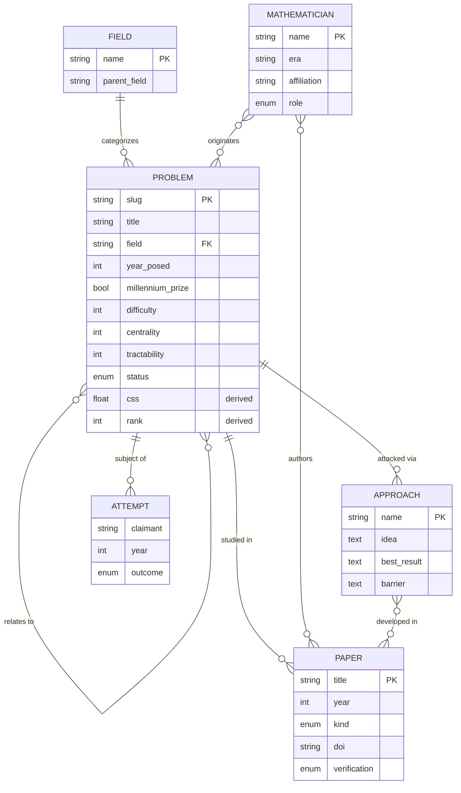

# 🗂️ Entity–Relationship Model (ERD / ERM / ERP)

This document specifies the conceptual data model behind the atlas. Although the
atlas is stored as files (YAML + markdown + JSONL), it is *modeled* as a small
graph database. This spec covers three layers:

- **ERM** — Entity-Relationship *Model* (entities, attributes, relationships)
- **ERD** — the diagram of that model
- **ERP** — Entity-Relationship *Process* (how entities move through workflow)

---

## 1. Entities

### PROBLEM (primary entity)
| Attribute | Type | Notes |
|-----------|------|-------|
| `slug` | string (PK) | stable kebab-case key |
| `title` | string | display name |
| `field` | string (FK → FIELD) | primary discipline |
| `subfields` | string[] | secondary disciplines |
| `year_posed` | int | negative = BCE |
| `originators` | string[] (→ MATHEMATICIAN) | who posed it |
| `millennium_prize` | bool | Clay Millennium status |
| `statement_plain` | text | one-paragraph statement |
| `difficulty` | int 0–100 | editorial |
| `centrality` | int 0–100 | editorial |
| `tractability` | int 0–100 | editorial |
| `status` | enum | open / active-progress / disputed-claim / conditionally-resolved / recently-resolved |
| `tags` | string[] | search facets |
| `css` | float | **derived** — Composite Severity Score |
| `rank` | int | **derived** — position by CSS |

### MATHEMATICIAN
| Attribute | Type | Notes |
|-----------|------|-------|
| `name` | string (PK) | full name |
| `era` | string | e.g. "19th century", "contemporary" |
| `affiliation` | string | institution(s) |
| `role` | enum | originator / breakthrough / frontier / expositor |
| `bio_ref` | string | source (MacTutor, etc.), flagged |

### PAPER
| Attribute | Type | Notes |
|-----------|------|-------|
| `title` | string | |
| `authors` | string[] (→ MATHEMATICIAN) | |
| `year` | int | |
| `venue` | string | journal / arXiv |
| `kind` | enum | foundational / breakthrough / survey / modern / computational / negative-result / expository |
| `doi` / `arxiv` | string | identifiers |
| `verification` | enum | verified / high-confidence / needs-verification / ai-suggested |

### APPROACH
| Attribute | Type | Notes |
|-----------|------|-------|
| `name` | string | e.g. "Sieve theory", "Hodge–Arakelov" |
| `idea` | text | the strategy in one paragraph |
| `best_result` | text | furthest this approach has reached |
| `barrier` | text | known obstruction, if any |

### ATTEMPT
| Attribute | Type | Notes |
|-----------|------|-------|
| `claimant` | string (→ MATHEMATICIAN) | |
| `year` | int | |
| `outcome` | enum | partial / withdrawn / refuted / disputed / open |
| `summary` | text | |

### FIELD (lookup)
`name` (PK), `parent_field`. E.g. *Analytic Number Theory* ⊂ *Number Theory*.

---

## 2. Relationships & cardinalities

| From | Relationship | To | Cardinality |
|------|--------------|----|-------------|
| PROBLEM | belongs to | FIELD | many-to-one |
| PROBLEM | originated by | MATHEMATICIAN | many-to-many |
| PROBLEM | studied in | PAPER | one-to-many |
| PROBLEM | attacked via | APPROACH | one-to-many |
| PROBLEM | subject of | ATTEMPT | one-to-many |
| PROBLEM | relates to | PROBLEM | many-to-many (self) |
| MATHEMATICIAN | authors | PAPER | many-to-many |
| APPROACH | developed in | PAPER | many-to-many |

---

## 3. ERD



---

## 4. Physical mapping (model → files)

The logical model is denormalized onto the filesystem:

| Logical entity | Physical storage |
|----------------|------------------|
| PROBLEM (attributes) | `data/problems.yaml` entry + `problems/NNN-slug/metadata.json` |
| PROBLEM ↔ PAPER | `problems/NNN-slug/papers.md` (table) |
| PROBLEM ↔ MATHEMATICIAN | `problems/NNN-slug/mathematicians.md` + `originator.md` |
| PROBLEM ↔ APPROACH | `problems/NNN-slug/approaches.md` |
| PROBLEM ↔ ATTEMPT | `problems/NNN-slug/attempts.md` |
| derived `css`, `rank` | computed by `generate.py`, persisted to `problems.json` |
| retrieval projection | `rag/corpus.jsonl` (chunked view of all of the above) |

A future hardening step (EPIC-3) can materialize this into an actual graph DB
(e.g. SQLite + a `relations` table, or Neo4j) without changing the source of
truth — the YAML remains canonical and the DB becomes another generated view.

---

## 5. ERP — process layer

The same entities flow through the [Kanban](../kanban/KANBAN.md) lifecycle:

```
REGISTRY(row) ─▶ SCAFFOLD(folder) ─▶ DRAFT(dossier) ─▶ VERIFY(flags) ─▶ PUBLISH
```

State is encoded, not tracked separately:
- a PROBLEM is **drafted** when its section files lose the `<!-- DOSSIER:* -->`
  markers;
- it is **verified** when no `ai-suggested` flags remain in `papers.md`;
- it is **published** when CI is green on `main`.

This makes the process auditable from the repository state alone — no external
project-management database required.
